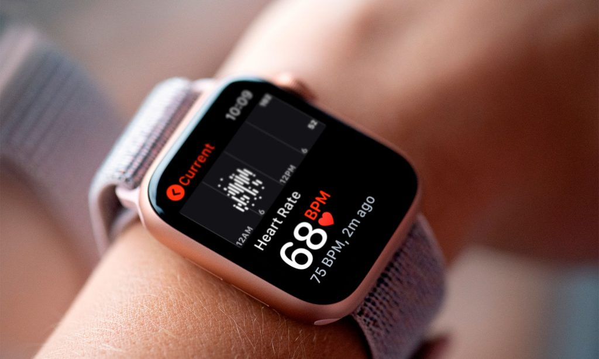
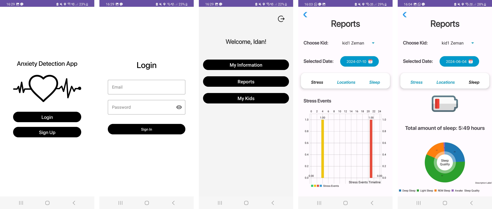

# 💡 AI-Enhanced Anomaly Detection for Children 

<!-- cool project cover image -->

<!-- table of content -->
## Table of Contents
- [The Team](#the-team)
- [Project Description](#project-description)
- [Getting Started](#getting-started)
- [Prerequisites](#prerequisites)
- [Installing](#installing)
- [Testing](#testing)
- [Deployment](#deployment)
- [Built With](#built-with)
- [Acknowledgments](#acknowledgments)

## 👥 The Team 
**Team Members**
- [Shira Dahan](shira.dahan@mail.huji.ac.il)
- [Idan Zeman](idan.zeman@mail.huji.ac.il)

**Mentor**
- [Rhea Chowers](rhea.chowers@mail.huji.ac.il)

## 📚 Project Description
The "AI-Enhanced Anomaly Detection for Children" project focuses on improving children's mental health by using wearable technology and machine learning to detect physiological anomalies correlated with stress and anxiety. The system primarily uses heart rate variability (HRV), sleep patterns, and behavioral data from smartwatches to identify potential anxiety-inducing events. It provides timely alerts to parents through a mobile application, allowing for personalized interventions that can improve a child's well-being.

## Key Features
- **Real-time Anxiety Detection:** Tracks physiological data in real-time to identify abnormal stress levels.
- **Parental Alerts:** Sends instant notifications to parents when anomalies suggest a potential stress or anxiety event.
- **Customizable Reports:** Provides detailed reports on children’s stress-related metrics, such as sleep disturbances and time spent in vehicles.
- **User-friendly Android Interface:** Designed for ease of use, the mobile app helps parents stay informed and manage their child's health proactively.
- **Personalized Monitoring:** Adapts to each child’s unique physiological data, improving the accuracy of anomaly detection.

## Components
- **Smartwatch Sensors:** Collects real-time physiological data, including heart rate variability (HRV).
- **ML-Based Detection:** Analyzes data to detect anomalies that correlate with stress and anxiety episodes.
- **Parental Mobile App:** Notifies parents of anomalies and provides insights through a user-friendly interface.
- **Cloud Storage & Analysis:** Securely stores data and enables long-term tracking and in-depth analysis.

## ⚡ Getting Started

These instructions will give you a copy of the project up and running on
your local machine for development and testing purposes. 

### 🧱 Prerequisites
- **Smartwatch:** Garmin wearables (or similar devices) for real-time data collection.
- **Mobile Device:** Android smartphone for running the mobile app.

### 🏗️ Installing
Clone the repository: 

    git clone https://github.com/zemani2/FinalProject.git
    
Install dependencies: 

    Run ./gradlew build in the Android Studio environment.

Start the App:

    ./FinalProject/app/src/main/java/com/example/anxietyByHeartRate/StartActivity.java

## 🧪 Testing
To test the anomaly detection model and app functionality:

- **Simulate data inputs:** Use Garmin devices to collect HRV and other physiological metrics.
- **Trigger anomalies:** Create scenarios with abnormal data patterns (e.g., disrupted sleep).
- **Verify alerts:** Check that the app sends alerts when significant stress indicators are detected.

## 🚀 Deployment
For live deployment:
Connect the app to live Garmin watch data.
Monitor real-time feedback through the app.
Deploy updates using Firebase for seamless updates to the backend and user interface.

## ⚙️ Built With
  - **Android Studio:** For mobile app development.
  - **Firebase:** For real-time data storage and user management.
  - **Garmin API:** For collecting and integrating physiological data from smartwatches.
  - **Machine Learning Algorithms:** Unsupervised learning models for anomaly detection.

## 🙏 Acknowledgments
  - Special thanks to Rhea Chowers for mentorship.
